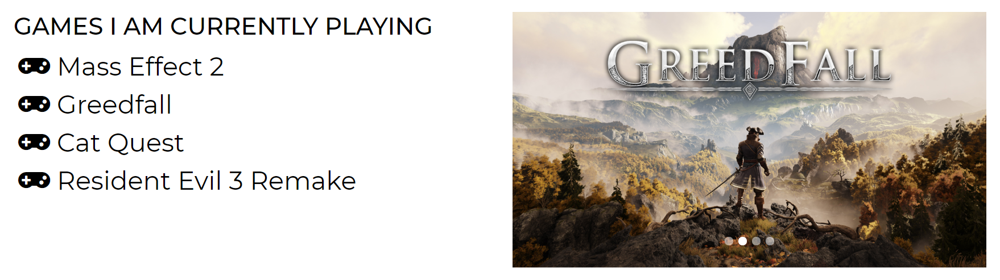
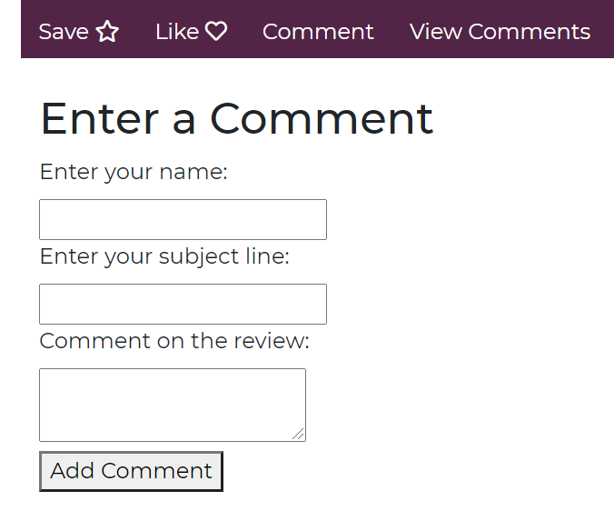
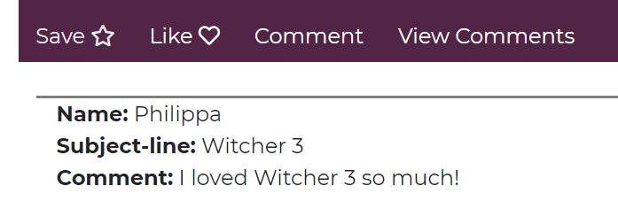

# MyGamingSite

This project is a website dedicated to my gaming hobby. It is meant to display my knowledge of HTML, Bootstrap, SCSS and JQuery. 

1. General Usage
1. Index Page Usage
1. About Page Usage
1. Favourites Page Usage
1. Saved For Later Page Usage
1. Contact Page Usage
1. Installation
1. Author and Update Details 

### GENERAL USAGE

The Navbar takes the user to the selected page. Clicking on the icon on the left of the navbar will return the user to the index page. The search bar is not currently functional.

### INDEX PAGE USAGE

The index page features a Bootstrap jumbotron. It also displays a Bootstrap carousel of games I am currently playing. The dots on the carousel images are clickable if you want to navigate to a specific image. The page also provides clickable links to some of my favourite Youtube gaming channels.

### ABOUT PAGE USAGE

The about page gives a brief overview of the author and has an animated clickable blockquote that when clicked will animate to another gaming quote. There are currently 3 quotes.  

### FAVOURITES PAGE USAGE

The favourites page allows for some interactivity for the user. The user can like a selected article by clicking the like button and upon doing so the heart icon will fill in. The user can also save a selected article by clicking the save button and upon doing so the star icon will fill in. Saved items will appear on the Saved For Later page. 

The user can also comment on an article and view comments on the article. The states of all these features are stored in local storage on the user's browser. 

### SAVED FOR LATER PAGE USAGE

This page displays any items currently saved on the Favourites page with the same styling as the Favourites page. There is currently no interactivity on this page.

### CONTACT PAGE USAGE

The contact page provides a form that the user can fill out in order to contact me. It is currently not working but the submit button should take the user to their default email and clear the form upon clicking. 

### INSTALLATION

There is no installation required for this site but certain elements may not work on Internet Explorer.

### AUTHOR AND UPDATE DETAILS

This page was created by Philippa Colly and last updated in February 2021

